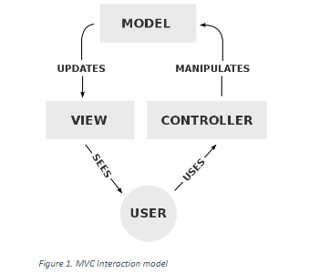
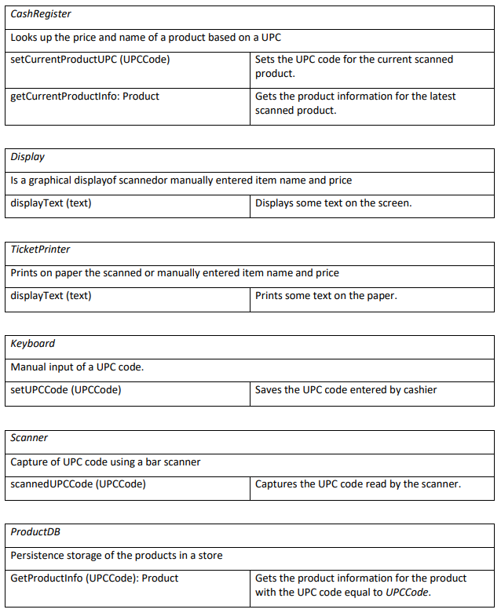

# assignment3-ArchitecturePatternsAndStyles

## Background Info on the MVC Pattern
The MVC pattern has always been a misunderstood architectural pattern that is implemented in 2 basic approaches. Fundamentally the pattern leverages an interaction pattern as shown in Figure 1. The differences are primarily on how the update to the View is implemented in the 2 approaches and their implied dependencies

In some examples the updates are direct calls to the View operators (Dependency from Model to View) and on other examples the Observer pattern is implemented creating a stronger dependency from the View to the Model. 

### Dependencies in the MVC Pattern
The ideal dependency that one wants to achieve in the MVC pattern is from the View and Controller to the Model. The Controller already has a natural dependency from the Controller to the model as the Controller leverages the operators in the Model to update the state of the Model. 

## The Cash Register Application
Going back to the Cash Register Requirements one can define the following significant components: *CashRegister, Display, Keyboard, TicketPrinter, Scanner,* and *ProductDB.*  The responsibilities and operators for each module are listed below:

